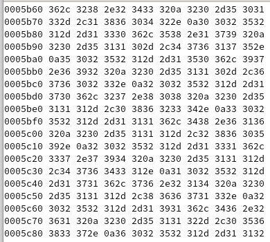
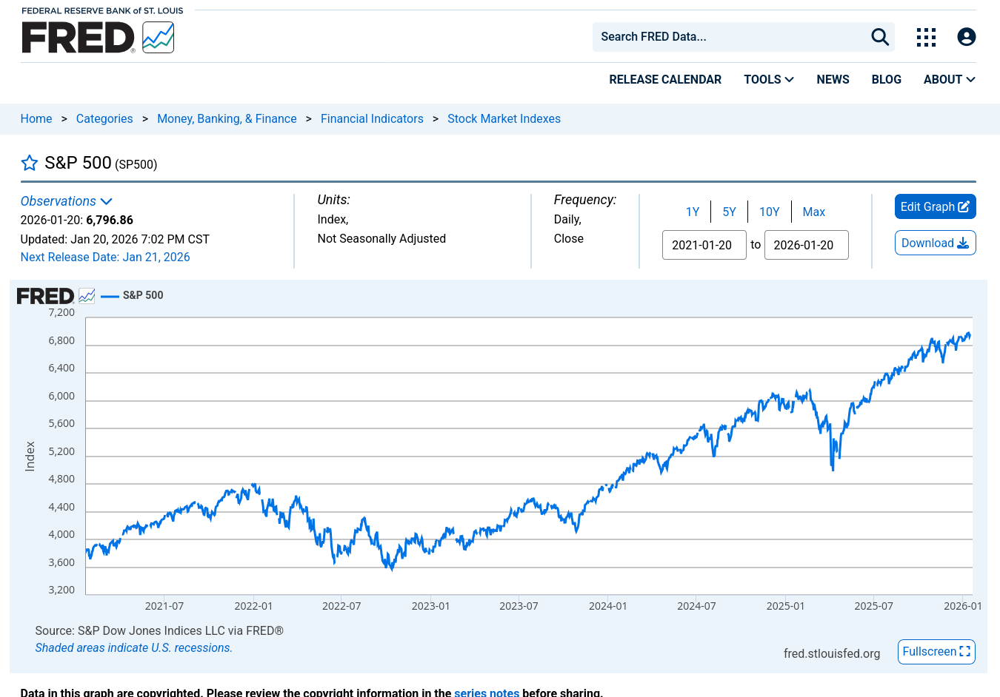

# What is this?



## If you I tell you that...


## If I give you a name...

> `...`

> `SP500.csv`

> `...`

## If I show you its contents...

::::{.columns}  

::: {.column width="10%"}
::: 
::: {.column width="80%"}

```{r sp500, include=TRUE,echo=TRUE}
# read in the data
sp500 <- read.csv(here::here("presentation","SP500.csv"))
head(sp500)
```
:::
::: {.column width="10%"}
:::
::::

## If I tell you where I got it from...


::::{.columns}  

::: {.column width="10%"}
::: 
::: {.column width="80%"}

:::
::: {.column width="10%"}
:::
::::

## But I cannot give it to you! {.smaller}

::::{.columns}  

::: {.column width="10%"}
::: 
::: {.column width="80%"}

> Copyright © 2016, S&P Dow Jones Indices LLC. All rights reserved. Reproduction of S&P 500 in any form is **prohibited** except with the prior written permission of S&P Dow Jones Indices LLC ("S&P").

:::
::: {.column width="10%"}
:::
::::

## So how can you verify my results?

- By obtaining the file again
- By running my code again
- By verifying that the results are the same!

#  **Trust but verify!**

- Reproducibility is key!
- But there are weaknesses...

## What if you could verify the file?

```{r checksum, include=TRUE,echo=TRUE}
# compute checksum of the file
tools::md5sum(here::here("presentation","SP500.csv"))
```
- The checksum is a unique fingerprint of the file
- If the file changes, the checksum changes