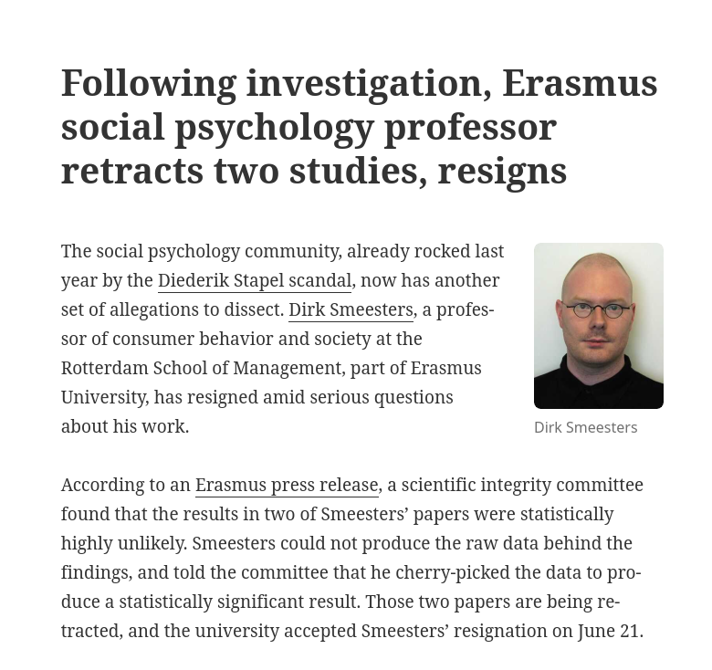
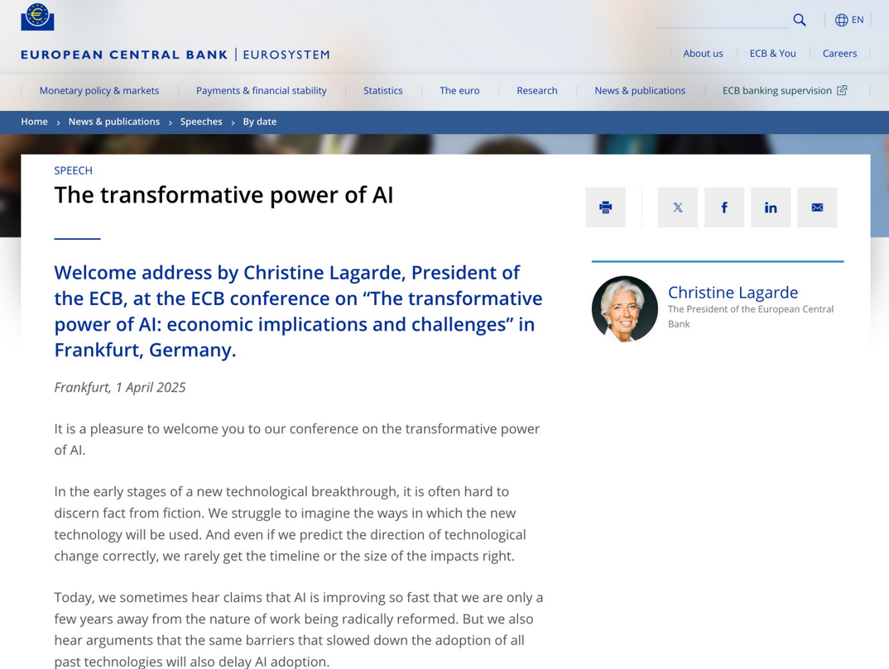

# The issue of provenance

## SP500

- Created by S&P Dow Jones Indices LLC
- Widely used as a market benchmark
- Commercial product, cannot be redistributed
- S&P considered **reliable**
- **Me** getting the file is the *weak link*

# What if I am the collector of data?

## Who is this person?

## Dirk Smeesters

## Retraction {.smaller}

::::{.columns}  

::: {.column width="10%"}
:::
::: {.column width="80%"}
"a scientific integrity committee found that the results in two of Smeesters’ papers were **statistically highly unlikely**. Smeesters *could not produce the raw data* behind the findings, and told the committee that he **cherry-picked** the data to produce a statistically significant result. Those two papers are being retracted, and the university accepted Smeesters’ *resignation* on June 21."

:::
::: {.column width="10%"}
:::
::::

## Who is this person? (2)

## Aidan Toner-Rodgers

## Maybe you've heard about him

::::{.columns}  

::: {.column width="50%"}

::: 
::: {.column width="50%"}

["AI-assisted researchers discover 44% more materials, resulting in a 39% increase in patent filings."](https://www.economist.com/finance-and-economics/2025/05/22/what-the-failure-of-a-superstar-student-reveals-about-economics)

:::
::::

## Now {.smaller}

::::{.columns}  

::: {.column width="10%"}
::: 
::: {.column width="80%"}
"MIT now declares “**no confidence in the provenance**, reliability or validity of the data and...in the veracity of the research”. Mr Toner-Rodgers’s paper has been *withdrawn* from the pre-print repository on which it first appeared [arXiv]; ... The lab at the heart of his findings remains **unknown**." 

:::
::: {.column width="10%"}
:::
::::

# How can we know that a data source is reliably obtained?

## Consider the case of Gino

## The case of Gino

- Francesca Gino was a *tenured* professor at Harvard Business School, writing on **honesty** (!)

## The case of Gino

- Several articles were investigated by third parties (*Data Colada*, in particular [^colada1]), and found to be **problematic**

::::{.columns}  

::: {.column width="10%"}
:::

::: {.column width="80%"}

:::
::: {.column width="10%"}
:::
::::

[^colada1]: <https://datacolada.org/109>, <https://datacolada.org/110>, <https://datacolada.org/111>, <https://datacolada.org/112>, <https://datacolada.org/114>, <https://datacolada.org/118>

## The case of Gino

- At least one of them had manipulated data **AFTER** it had been collected, **BEFORE** it had been analyzed.

:::: {.columns}

::: {.column width="50%"}

:::

::: {.column width="50%"}

:::
::::
