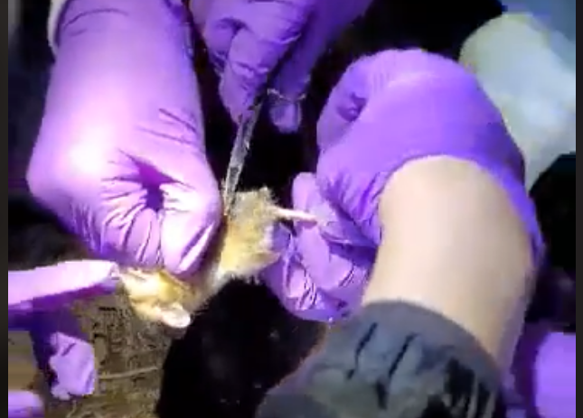
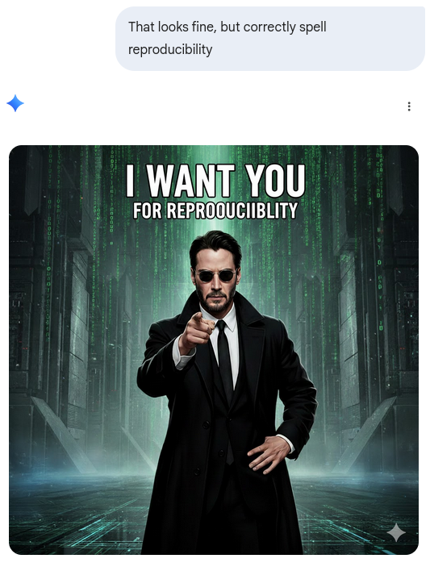
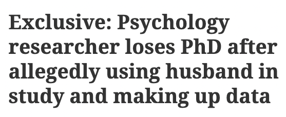
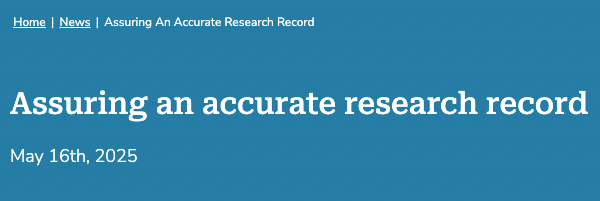
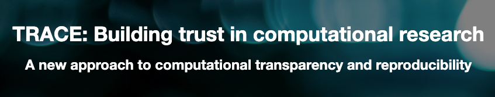

# What can **YOU** do?

## What is this?

## Training

- Biology students learn key lab techniques
  - Pipetting
  - Capture-recapture of wild animals

## **YOU**!

# (BTW...)

When I prompted Gemini to correct the spelling in "Reproducibility", it only made it worse!

# Back to the topic

## Generic survey processing

::: {.white-col}

:::

## Generic survey processing

::: {.white-col}

:::

## Requiring transparency in academia

::: {.white-col}

:::

## Verifying transparency in academia

::: {.white-col}

:::

## Verification by journals

- **Provision** (publication of materials) provides transparency
- **Verification** (running the analysis again - computational reproducibility) compensates for *mistrust*/*absence of trust*

## Which journals  {.smaller}

- [American Economic Association](https://www.aeaweb.org/journals/) (8)
- [Econometric Society](https://www.econometricsociety.org/) (3)
- [Canadian Journal of Economics](https://www.economics.ca/cje-home) (1)
- [Royal Economic Society](https://res.org.uk/journals/) (2)
- [Western Economic Association International](https://weai.org/view/EI-Journal-Policies) (1)
- [European Economic Association](http://www.eeassoc.org/journal) (1)
- [Review of Economic Studies](https://www.restud.com/) (1)
- [Journal of the European Economic Association](https://academic.oup.com/jeea) (1)
- [Journal of Political Economy](https://www.journals.uchicago.edu/journals/jpe/about) (3)
- [American Journal of Political Science](https://onlinelibrary.wiley.com/page/journal/15405907/) (1)
- [American Political Science Review](https://www.cambridge.org/core/journals/american-political-science-review) (1)

## Verification by others

::::{.columns}
:::{.column width="50%"}

- Pre-publication: [cascad](https://www.cascad.tech/)

:::
:::{.column width="50%"}

- Post-publication: [Data Colada](https://datacolada.org/), [Institute for Replication](https://i4replication.org/)

:::
::::

## Verification by institutions

::::{.columns}
:::{.column width="50%"}

- [World Bank](https://reproducibility.worldbank.org/index.php/home)[^jones]

[^jones]: Jones, M. (2024). Introducing Reproducible Research Standards at the World Bank. Harvard Data Science Review, 6(4). <https://doi.org/10.1162/99608f92.21328ce3>

:::
:::{.column width="50%"}

:::
::::

## Taking it a step further

::: {.white-col}

:::

## Taking it a step further

- Has been discussed by authors behind Data Colada
- Survey tool provider (Qualtrics, etc.) exports data, posts **checksum**
- Survey tool provider exports data only to institution directly into trusted repository, researchers obtain data from there (with privacy protections)
- Researcher can verify **checksum**

## Does not prevent all fraud

::::{.columns}
:::{.column width="50%"}

[Toronto researcher loses Ph.D.](https://retractionwatch.com/2024/04/26/psychology-researcher-loses-phd-after-allegedly-using-husband-in-study-and-making-up-data/)

:::
:::{.column width="50%"}

[MIT student makes up firm data](https://economics.mit.edu/news/assuring-accurate-research-record)

:::
::::

## How to document the full process?

::: {.white-col}

:::

## A sketch: Transparency Certified

<https://transparency-certified.github.io/>

## Work in progress

- Working with [cascad](https://www.cascad.tech/), several [INEXDA](https://inexda.org) members, and others
- Relying on external certification of data inputs (data catalogs with metadata, checksums)

## Churchill said...

::::{.columns}
::: {.column width="50%"}

:::
::: {.column width="50%"}
"**Do not trust any statistics you did not fake yourself.**"
:::
::::

## Or did he...

::::{.columns}
::: {.column width="50%"}

:::
::: {.column width="50%"}
"No, of course, the British Prime Minister and Nobel Laureate for Literature never claimed such nonsense. But putting his name in front of a quote gives it a more solemn, more imposing, more definitive appearance." [[Source](https://winstonchurchill.hillsdale.edu/fake-churchill-quote/)]
:::
::::
